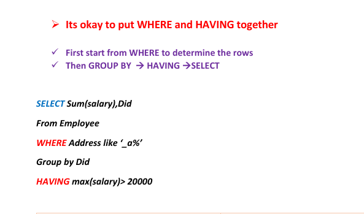
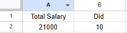
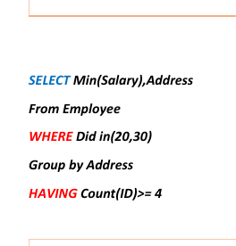
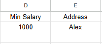
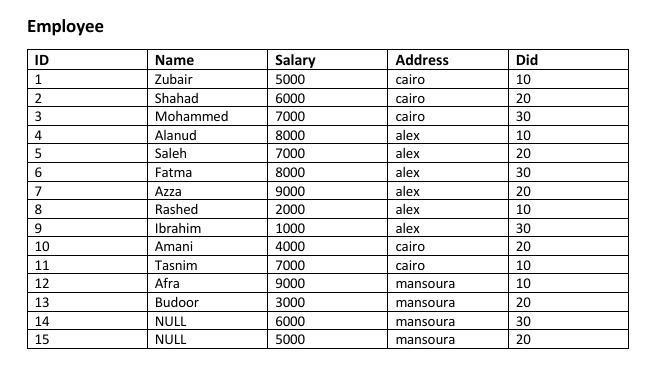
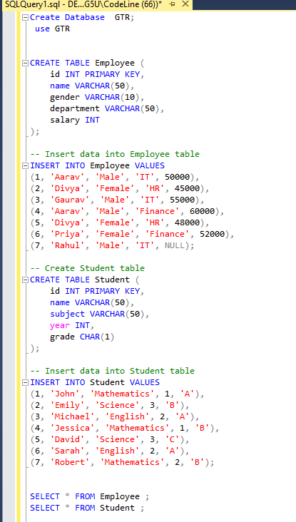
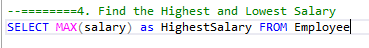
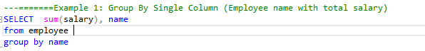
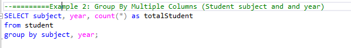
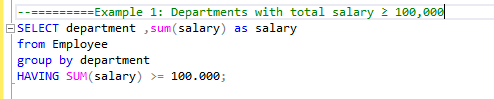

## ➢ Its okay to put WHERE and HAVING together 
 
✓ First start from WHERE to determine the rows  
✓ Then GROUP BY  → HAVING →SELECT 

TASK ONE : 

TASK 2:

Table : 

##TASK 3:

1. Count the Total Number of Employees

2. Calculate the Total Salary (ignoring NULL values)

4. Find the Highest and Lowest Salary 

Example 1: Group By Single Column (Employee name with total salary)

Example 2: Group By Multiple Columns (Student subject and and year)

Example 1: Departments with total salary ≥ 100,000 

