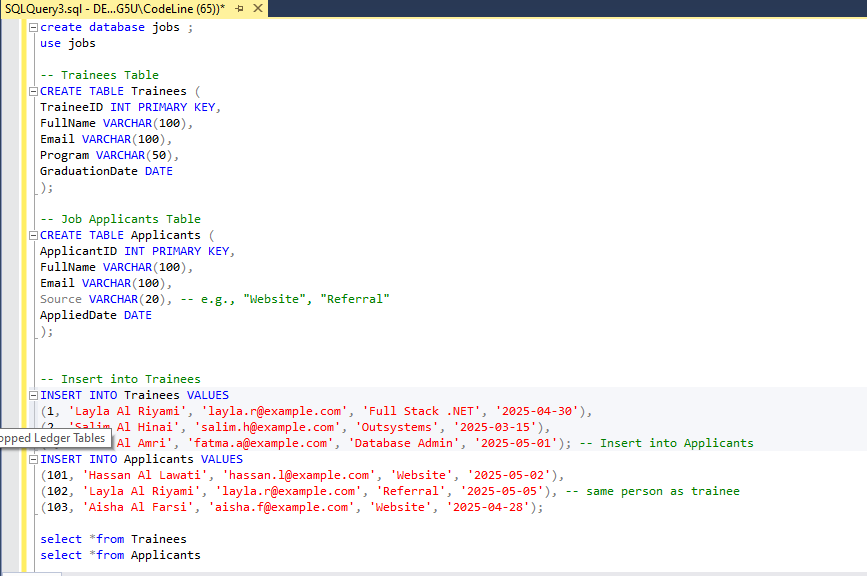
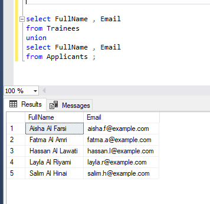
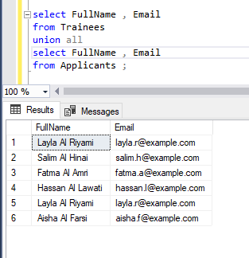
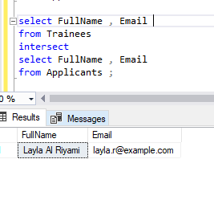
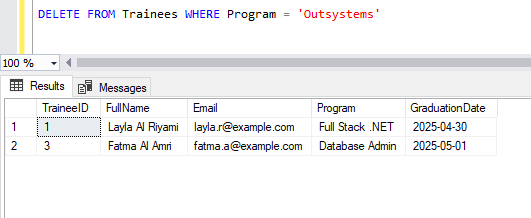
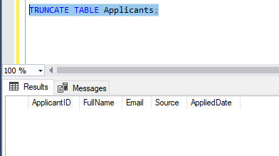

##Topics: 
1. UNION / UNION ALL 
2. DROP vs DELETE vs TRUNCATE 
3. Subqueries (exploratory task – they search and try it) 
4. Transaction & Batch Script (exploratory and guided) 
5. *Hands-on comparison with real effect on data 
Practice Scenario: Training & Job Application System 
Your institute is managing two main datasets: 
• Trainees: People who complete training at your institute. 
• Job Applicants: External applicants who apply directly to job posts. 
Your goal is to: 
• Compare the data of both groups. 
• Clean or restructure the database safely. 
• Explore more advanced SQL topics on your own (subqueries, transactions).
 

Part 1: UNION Practice 
1. List all unique people who either trained or applied for a job. 
o Show their full names and emails. 
o Use UNION (not UNION ALL) to avoid duplicates.
 

 2. Now use UNION ALL. What changes in the result? 
o Explain why one name appears twice. 

3. Find people who are in both tables. 
o You must use INTERSECT if supported, or simulate it using INNER JOIN on Email. 
 

 Part 2: DROP, DELETE, TRUNCATE Observation 
Let’s test destructive commands.

4. Try DELETE FROM Trainees WHERE Program = 'Outsystems'. 
o Check if the table structure still exists.

5.Try TRUNCATE TABLE Applicants. 
o What happens to the data? Can you roll it back? 

6. Try DROP TABLE Applicants. 
o What happens if you run a SELECT after that?

Part 3: Self-Discovery & Applied Exploration

